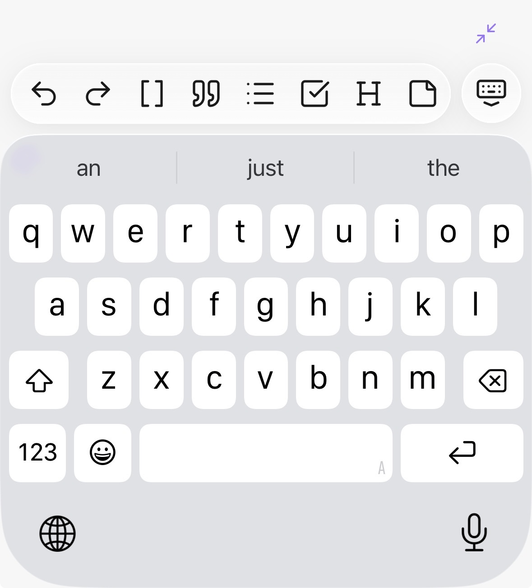
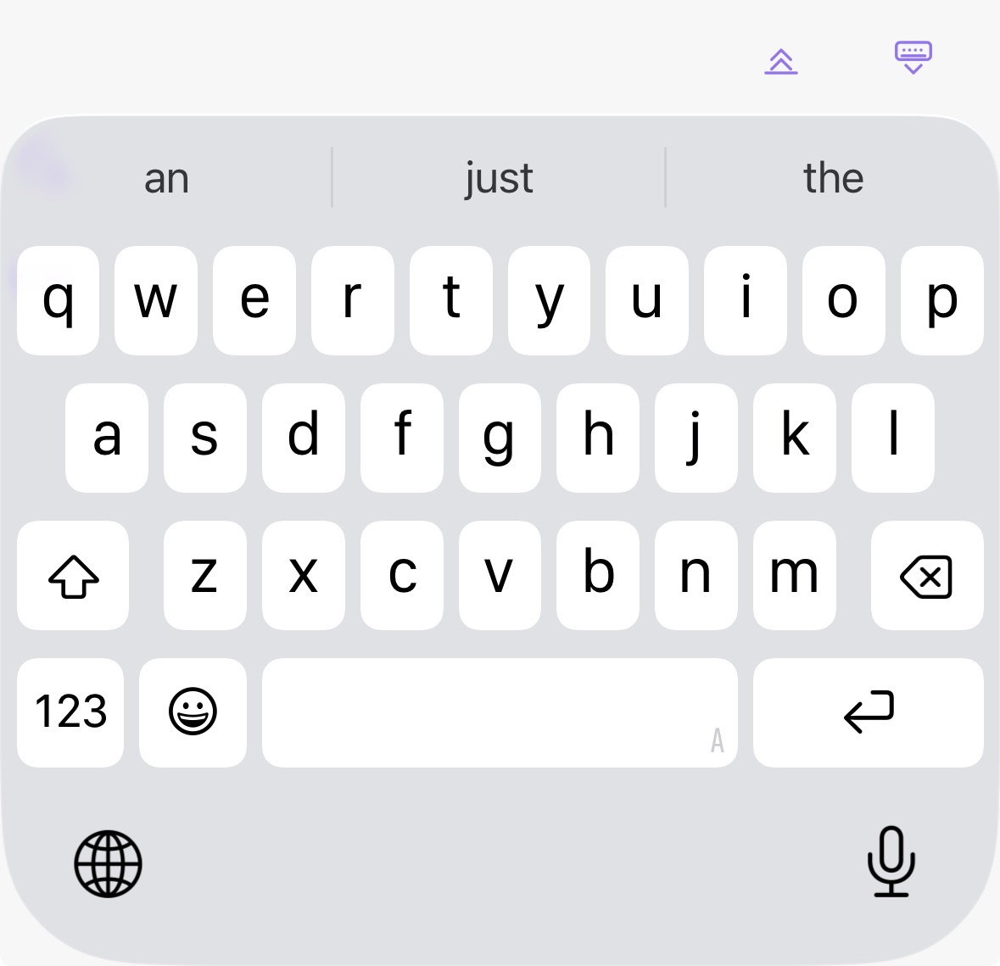

# Minimize Mobile Editor Toolbar

A small Obsidian mobile plugin that lets you hide and restore the native editor toolbar with a floating button, without dismissing the keyboard.

## What it does

- **Minimize button** floats above the native toolbar when editing. Tap it to collapse the toolbar and reclaim vertical space.
- **Expand + Dismiss buttons** take its place when minimized — tap expand to bring the toolbar back, or dismiss to close the keyboard.
- All buttons only appear when the software keyboard is active in an editor view.
- No box, no border — just the SVG icons in your Obsidian accent color.

## Install via BRAT

1. Install the [BRAT plugin](https://github.com/TfTHacker/obsidian42-brat) in Obsidian
2. In BRAT settings, add the beta plugin repository: `LeviathanDuck/Obsidian-Minimize-Mobile-Toolbar`
3. Enable the plugin in **Settings → Community Plugins**

## Settings

Two offset controls let you fine-tune the button position:

- **Offset when toolbar is visible** — how far the minimize button floats above the native toolbar
- **Offset when toolbar is minimized** — how far the expand + dismiss buttons float above their resting position

Defaults are 24 and 10, tuned for iPhone 15 Pro. Different devices may need different values.

## Beta

This plugin is in an early beta testing phase. If you hit something that doesn't work, please file an issue:

[Submit an issue on GitHub](https://github.com/LeviathanDuck/Obsidian-Minimize-Mobile-Toolbar/issues)

## Device compatibility

Developed and optimized on **iPhone 15 Pro**. Pixel offsets for the controls may need adjustment on devices with different resolutions or screen sizes — use the two offset fields in settings to fine-tune.

## Developers welcome

Making a floating button stick reliably above the software keyboard in Obsidian mobile is surprisingly hard. This plugin uses a **flex-sibling injected into `.app-container`** — it rides Obsidian's natural layout flow rather than trying to position via `visualViewport` math or fixed-bottom CSS (both of which were unreliable across iOS WKWebView states).

If you know a cleaner, more reliable technique, please open an issue or PR. This is essentially the gay-toolbar approach, and I'd love to hear of better ideas.

## Desktop

This plugin is mobile-only. It has no runtime effect on desktop — the native toolbar it targets doesn't exist there.

## License

MIT
